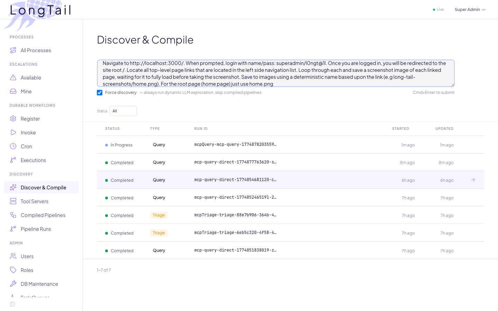
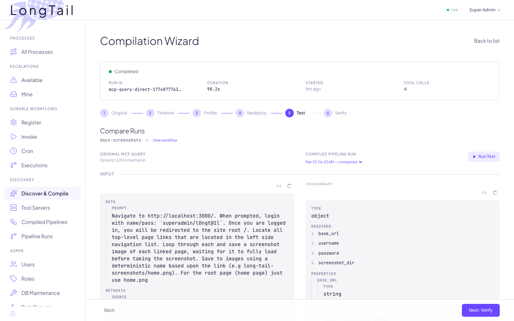
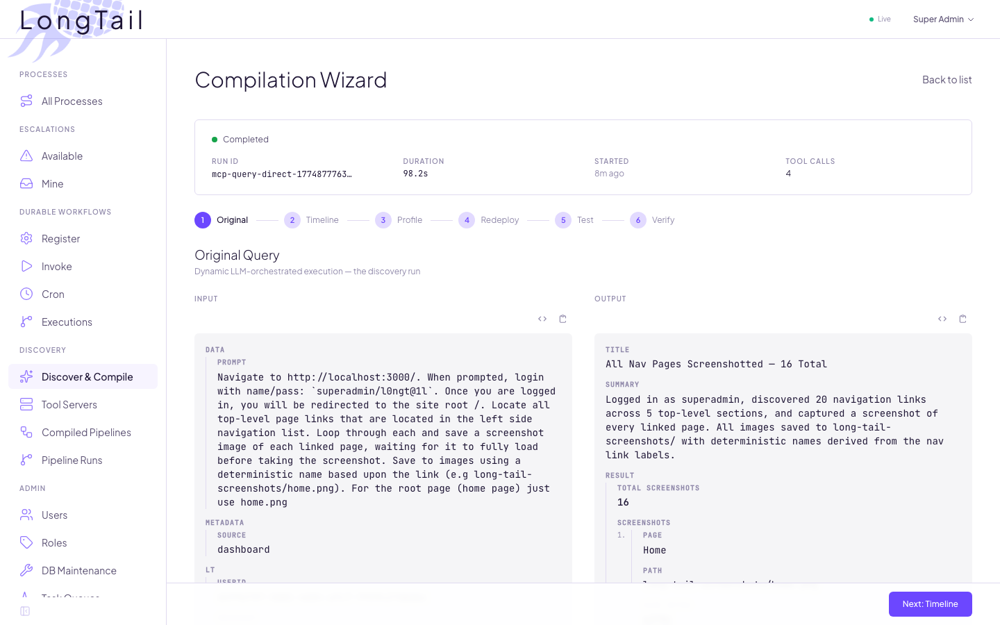
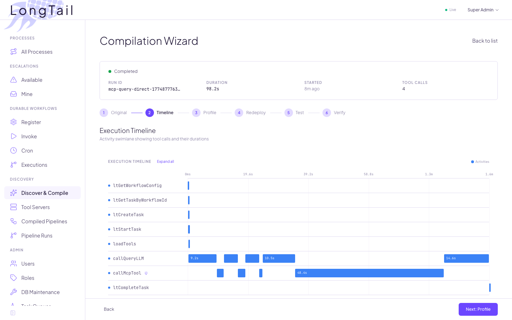
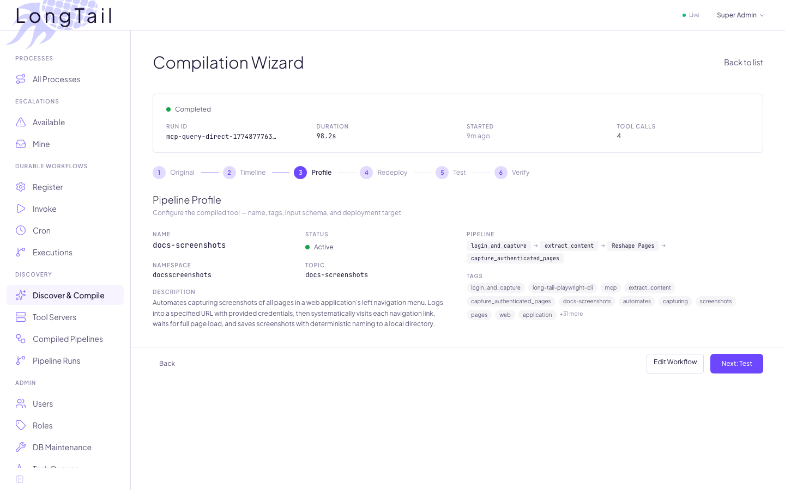
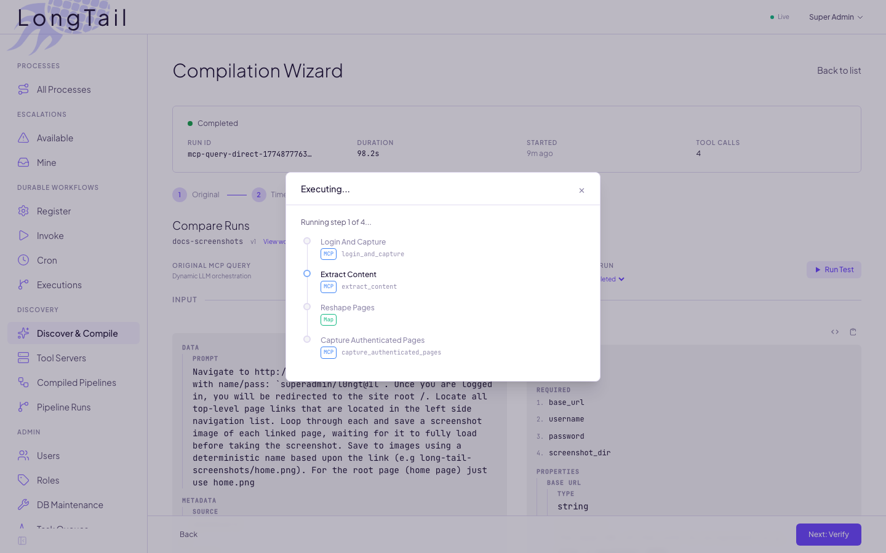
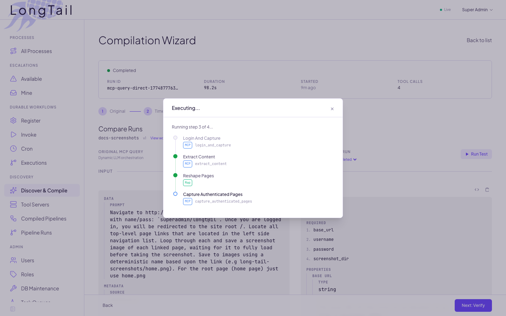

# The Compilation Pipeline

Every AI-driven execution carries cost. An LLM reasons through each step, selects tools, interprets results, and decides what to do next. It works, but it is slow, non-deterministic, and consumes tokens on every run.

Long Tail records what the LLM did, extracts the pattern, and compiles it into a deterministic workflow. The next time the same problem appears, it runs without an LLM — no reasoning, no token cost, same result.

This guide follows a single query through the full lifecycle: dynamic execution, compilation, deterministic replay, and automatic routing.

---

## The Dynamic Execution

Open the **Discover & Compile** page and describe what you need in natural language. The example below asks the system to log into the dashboard, discover all navigation pages, and screenshot each one.

<details>
<summary>Discover & Compile — prompt submission</summary>
<br/>

</details>

The system ships with a few preconfigured MCP servers and tools as reference examples (it's pluggable, so the list is your choice) — browser automation, file storage, database queries, HTTP fetch, and more. Additional servers can be registered at any time.

<details>
<summary>Tool Servers — registered MCP servers and their tools</summary>
<br/>

</details>

When the query is submitted, the `mcpQuery` workflow starts. It discovers available tools by tag (GIN-indexed full-text search), then enters an agentic loop: the LLM selects a tool, calls it, reads the result, and decides the next step. Every tool call is checkpointed by the workflow engine. If the process crashes mid-execution, it resumes from the last checkpoint — no work is lost, no step runs twice.

The run appears in the queries list once it completes.

<details>
<summary>Query detail — completed dynamic execution</summary>
<br/>

</details>

---

## The Compilation Wizard

Click into a completed query to open the six-panel compilation wizard. Each panel represents one stage of converting the dynamic execution into a deployable deterministic workflow.

### 1. Original

The first panel displays what the LLM produced: the input envelope and the structured output. This is the reference point — whatever the compiled workflow produces will be compared against it.

<details>
<summary>Panel 1 — original query input and output</summary>
<br/>

</details>

### 2. Timeline

A swimlane visualization of the execution. Each row is an MCP server, each block is a tool call, positioned on a time axis. The pattern is visible at a glance: the LLM logged in, extracted navigation links, then looped through each page to capture a screenshot.

<details>
<summary>Panel 2 — swimlane timeline</summary>
<br/>

</details>

### 3. Profile

The workflow needs an identity. The wizard auto-generates a description and suggests tags from the execution trace. You provide the namespace, tool name (this becomes the workflow's MCP tool name for discovery), and adjust tags as needed.

<details>
<summary>Panel 3 — workflow profile configuration</summary>
<br/>

</details>

Clicking **Create Profile** triggers the five-stage compilation pipeline:

1. **Extract** — parse the execution trace into an ordered step sequence
2. **Analyze** — detect iteration patterns (the screenshot loop), classify inputs as dynamic (user-provided) or fixed (implementation detail)
3. **Compile** — an LLM produces a blueprint with data-flow edges and session threading, guided by per-server **compile hints** stored in the database (e.g., which output fields to use as transform sources, how to thread browser session handles)
4. **Build** — generate a deterministic YAML DAG with activity wiring
5. **Validate** — check for missing wiring, lost session handles, broken iteration boundaries

### 4. Deploy

The deploy panel displays the compiled YAML definition, input schema, and output schema. The YAML encodes the DAG: each step names an MCP tool, declares its inputs (either from the user's request or from a prior step's output), and specifies data-flow edges.

<details>
<summary>Panel 4 — YAML configuration before deployment</summary>
<br/>

</details>

Clicking **Deploy & Activate** registers the workflow as a live MCP tool — tagged for discovery, versioned, invocable by any agent, workflow, or API call.

### 5. Test

The test panel runs the compiled workflow and compares it against the original dynamic execution. Click **Run test** to open the invocation modal with the pre-populated input schema.

<details>
<summary>Panel 5 — test invocation modal (mid-execution)</summary>
<br/>

</details>

After the deterministic run completes, the wizard shows both executions side by side.

<details>
<summary>Panel 5 — side-by-side comparison</summary>
<br/>

</details>

The difference is structural:

| | Dynamic (LLM) | Deterministic |
|---|---|---|
| **Tool calls** | N (LLM selects each) | 1 pipeline (pre-wired DAG) |
| **LLM usage** | Every step | Route + input extraction only |
| **Determinism** | Varies per run | Identical every time |

The deterministic path is faster because the LLM is used only at the edges — routing the request and extracting structured inputs from the prompt. The DAG itself executes tool calls directly with pre-wired data flow. No per-step reasoning, no tool selection, no interpretation.

### 6. Verify

The final panel confirms end-to-end routing. The original prompt is pre-filled. Click **Submit** to send it through the `mcpQueryRouter` — the same entry point any future request would use.

<details>
<summary>Panel 6 — router verification</summary>
<br/>

</details>

The router performs full-text search and tag matching to find candidate workflows, then uses an LLM judge to confirm scope. When confidence exceeds the threshold, the request goes straight to the compiled workflow.

```
User prompt → Router → Discovery (FTS + tags) → LLM Judge
                 │                                    │
                 │  confidence ≥ 0.7                  │  no match
                 ▼                                    ▼
            Deterministic                          Dynamic
        (compiled DAG, no LLM)                  (agentic loop)
```

---

## How It Accumulates

The first time a problem appears, the dynamic path runs. An LLM reasons through it — slow and expensive, but it works.

The wizard compiles the solution into a deterministic pipeline. A human reviews the DAG, adjusts if needed, and deploys.

Every subsequent occurrence is routed automatically. A single LLM call extracts structured inputs from the prompt, then the DAG executes without further reasoning.

Each compiled workflow is itself a discoverable MCP tool. Other workflows and agents can invoke it. Solutions compose. The inventory of deterministic pathways grows with every problem the system solves, and the fraction of requests that require LLM reasoning shrinks.

The dynamic path remains for genuinely new problems. But the long tail gets shorter.
