# From Dynamic to Deterministic: The Compilation Pipeline

Every AI-driven execution is expensive. An LLM reasons through each step, selects tools, interprets results, and decides what to do next. It works — but it's slow, non-deterministic, and costs tokens on every run.

Long Tail records what the LLM did, extracts the pattern, and converts it into a deterministic workflow. The next time the same problem appears, it runs automatically — no LLM, no reasoning, no cost.

This guide walks through the full lifecycle.

---

## Submit a Dynamic Query

Open the **Deterministic MCP** page and describe what you want in the prompt textarea. Press `Cmd+Enter` to submit.

<details>
<summary>Screenshot: prompt submission</summary>
<br/>
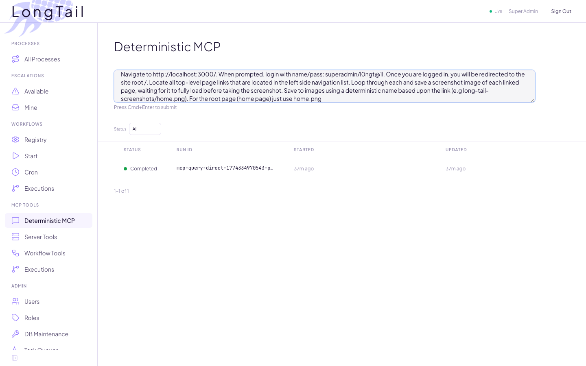
</details>

This example asks the system to log into the dashboard, discover all navigation pages, and screenshot each one. The system ships with 9 MCP servers and 42+ tools — browser automation, file storage, database queries, HTTP, and more — and additional servers can be registered at any time.

<details>
<summary>Screenshot: available MCP servers</summary>
<br/>
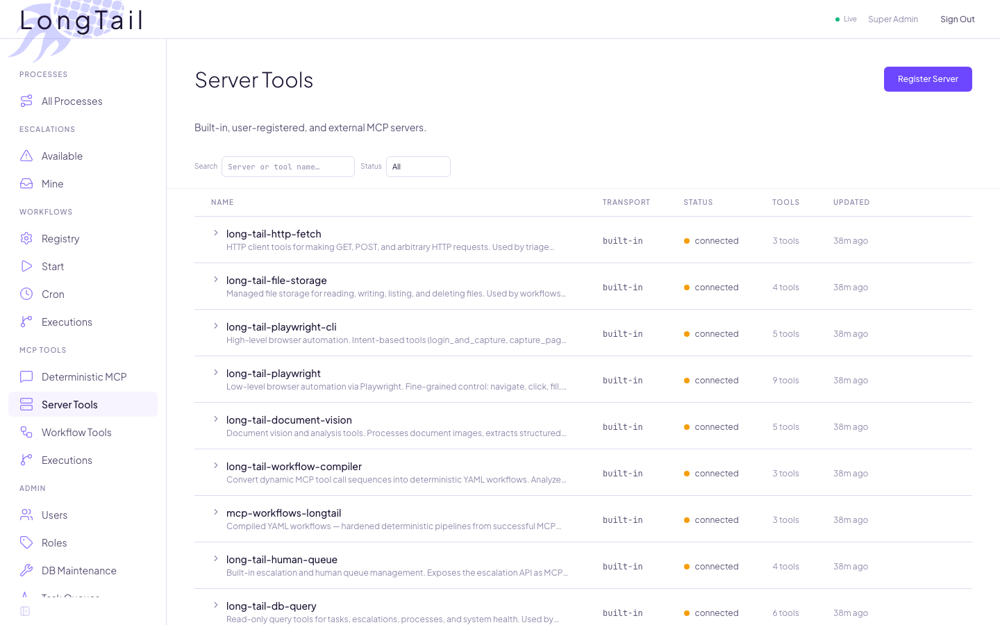
</details>

The LLM selects which tools to use and in what order. Every tool call is checkpointed — if the process crashes mid-execution, it resumes where it left off.

---

## The Dynamic Execution

When the run completes, it appears in the queries list. Click into it to open the **Deterministic MCP Wizard**.

<details>
<summary>Screenshot: completed query</summary>
<br/>
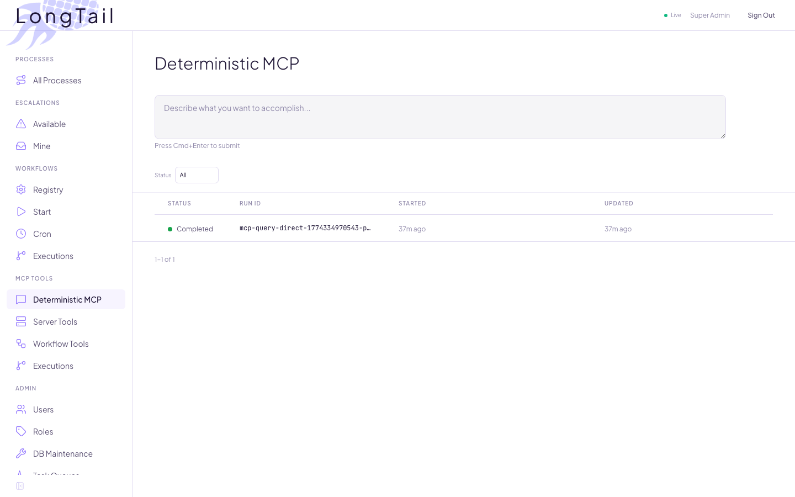
</details>

### Swimlane Timeline

The wizard's first step visualizes the execution as a swimlane timeline. Each row is an MCP server, each block is a tool call. You can see the LLM's strategy: login, extract content, then a batch capture of all discovered pages.

<details>
<summary>Screenshot: execution timeline</summary>
<br/>
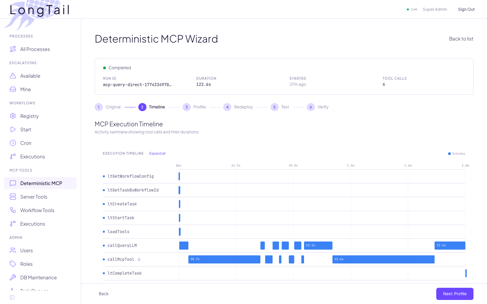
</details>

---

## Profile

The next step configures the workflow's identity. The wizard auto-generates a description and suggests tags. You provide a name (becomes the workflow's MCP tool name), description (how the router discovers it), and tags (for filtering).

<details>
<summary>Screenshot: workflow profile</summary>
<br/>
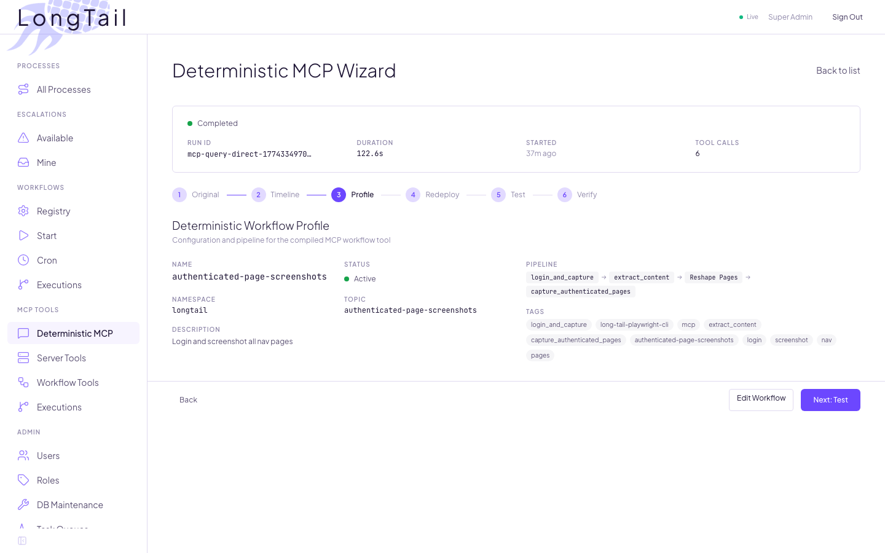
</details>

---

## Compile and Deploy

Clicking **Create Profile** triggers compilation. The pipeline analyzes the execution trace through five stages:

1. **Extract** — Parse tool calls into an ordered step sequence
2. **Analyze** — Detect iteration patterns, classify inputs
3. **Compile** — LLM produces a blueprint with data flow edges and session threading
4. **Build** — Generate a deterministic DAG with activity wiring
5. **Validate** — Check for missing wiring, lost session handles, broken iterations

Each MCP server provides **compile hints** — tool-specific constraints stored in the database that guide the LLM's wiring decisions (e.g., which output fields to use as transform sources, how to thread browser session handles).

The deploy step shows the compiled configuration and activates it as a live MCP tool — tagged for discovery, invocable via API or tool call.

<details>
<summary>Screenshot: compiled workflow configuration</summary>
<br/>
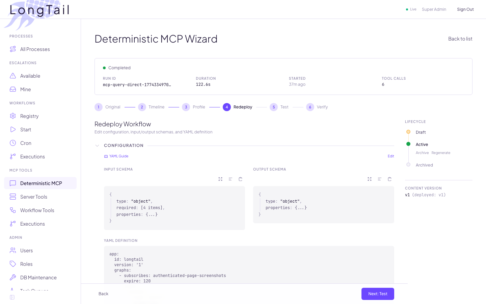
</details>

---

## Test

The test step runs the deterministic workflow and compares it against the original dynamic execution. Click **Run test** to open the invocation modal with the pre-populated input schema.

<details>
<summary>Screenshot: test invocation modal</summary>
<br/>
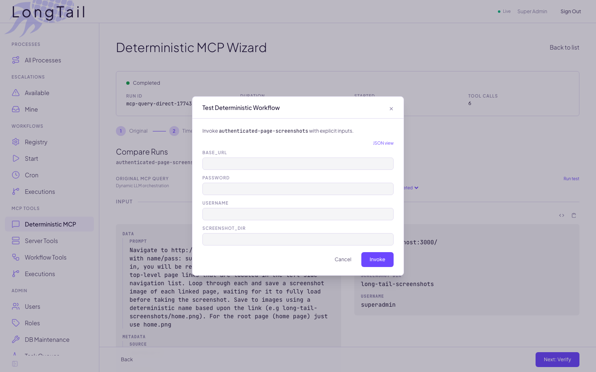
</details>

After the deterministic run completes, the wizard shows a **Compare Runs** view with both executions side by side.

<details>
<summary>Screenshot: side-by-side comparison</summary>
<br/>
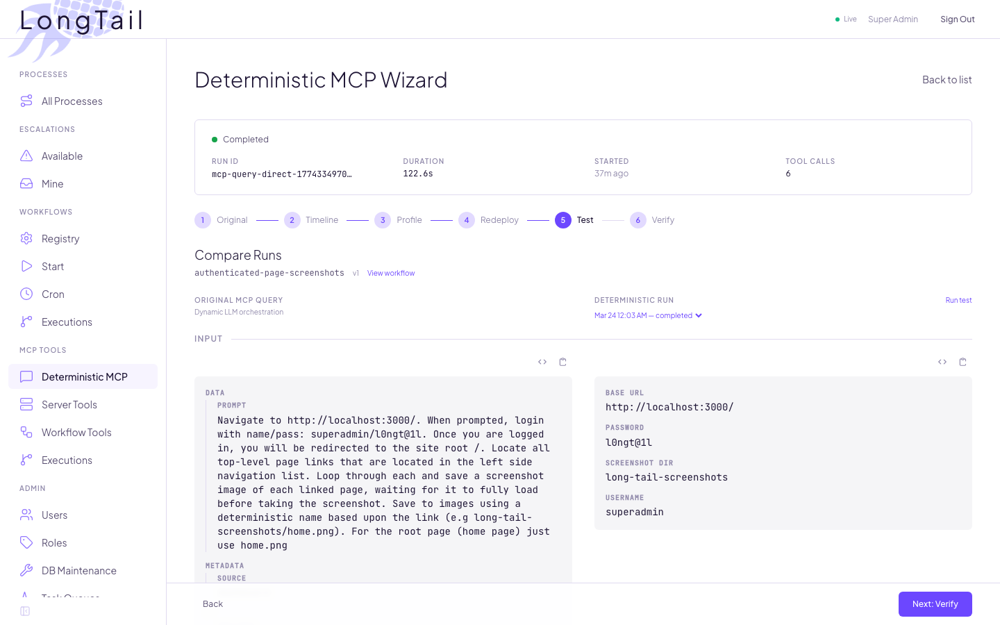
</details>

### The Numbers

| | Dynamic (LLM) | Deterministic |
|---|---|---|
| **Tool calls** | 6 (LLM selects each) | 1 (deterministic pipeline) |
| **LLM reasoning** | Every step | Route + extract inputs only |
| **Duration** | ~130s | ~50s |
| **Token cost** | Thousands | Minimal (routing + input extraction) |
| **Determinism** | Varies per run | Identical every time |

The deterministic path is faster because the LLM is only used at the edges — routing and input extraction. The DAG itself executes tool calls directly with pre-wired data flow. No per-step reasoning, no tool selection, no interpretation. Same input, same output, every time.

---

## Verify the Router

The final step confirms end-to-end routing. When a new request matches the deployed workflow, the router sends it to the deterministic path instead of the dynamic LLM loop.

<details>
<summary>Screenshot: end-to-end verification</summary>
<br/>
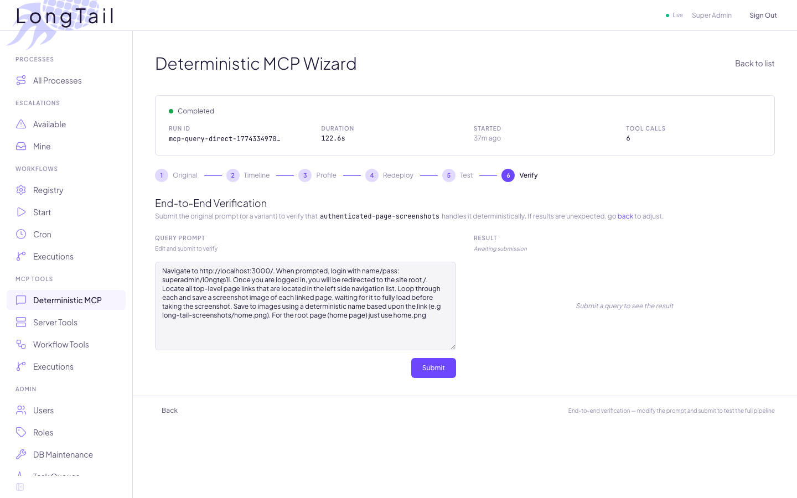
</details>

The router performs full-text search and tag matching to find candidates, then uses an LLM judge to confirm scope. When confidence exceeds 0.7, the request goes straight to the compiled workflow.

```
User prompt → Router → Discovery (FTS + tags) → LLM Judge
                 │                                    │
                 │  confidence ≥ 0.7                  │  no match
                 ▼                                    ▼
            Deterministic                          Dynamic
        (compiled, no LLM)                      (agentic loop)
```

In our test, the router matched with **0.98 confidence** — the request went directly to the compiled workflow without any LLM reasoning.

---

## The Deployed Workflow

The compiled workflow appears in the **Workflow Tools** registry.

<details>
<summary>Screenshot: workflow registry</summary>
<br/>
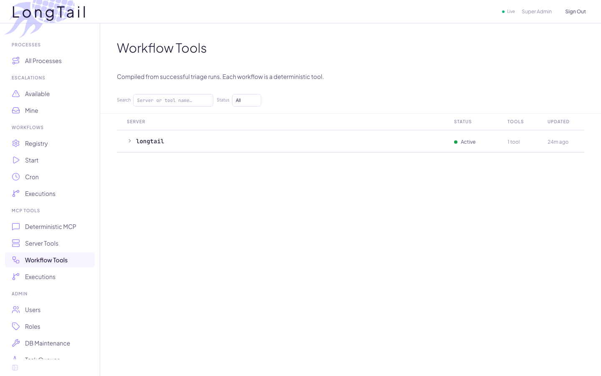
</details>

Each workflow tracks its activity manifest, input/output schema, DAG definition, and provenance back to the original execution.

<details>
<summary>Screenshot: workflow detail</summary>
<br/>
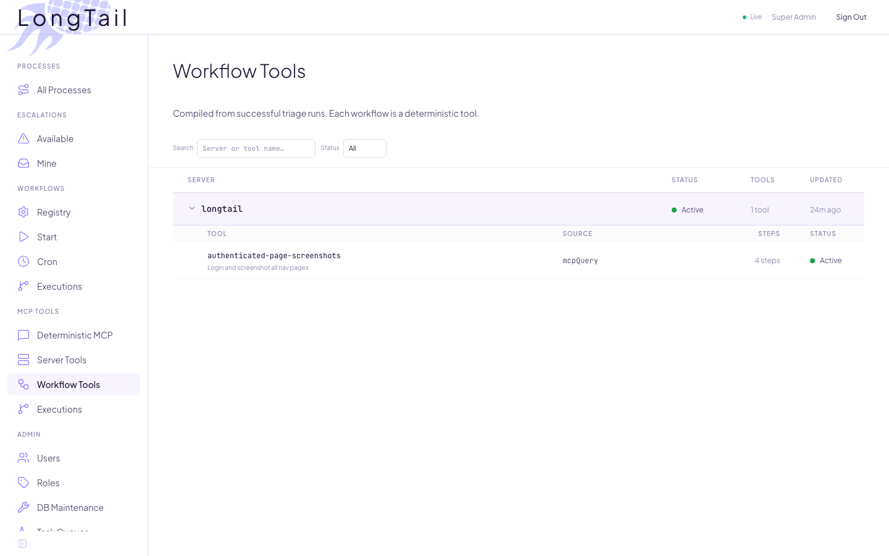
</details>

---

## How It Accumulates

1. **First occurrence** — Dynamic path runs. An LLM reasons through the problem. Slow and expensive, but it works.

2. **Compilation** — The wizard produces a deterministic pipeline. A human reviews and deploys.

3. **Every subsequent occurrence** — The router matches and runs the compiled workflow. A single LLM call extracts structured inputs from the prompt, then the DAG executes without further reasoning.

4. **The inventory grows** — Each compiled workflow becomes a tool that other workflows and agents can discover and invoke. Solutions compose. The system gets faster with every problem it solves.

The dynamic path handles genuinely new problems. But the deterministic inventory grows, and the fraction of requests that need LLM reasoning shrinks.
