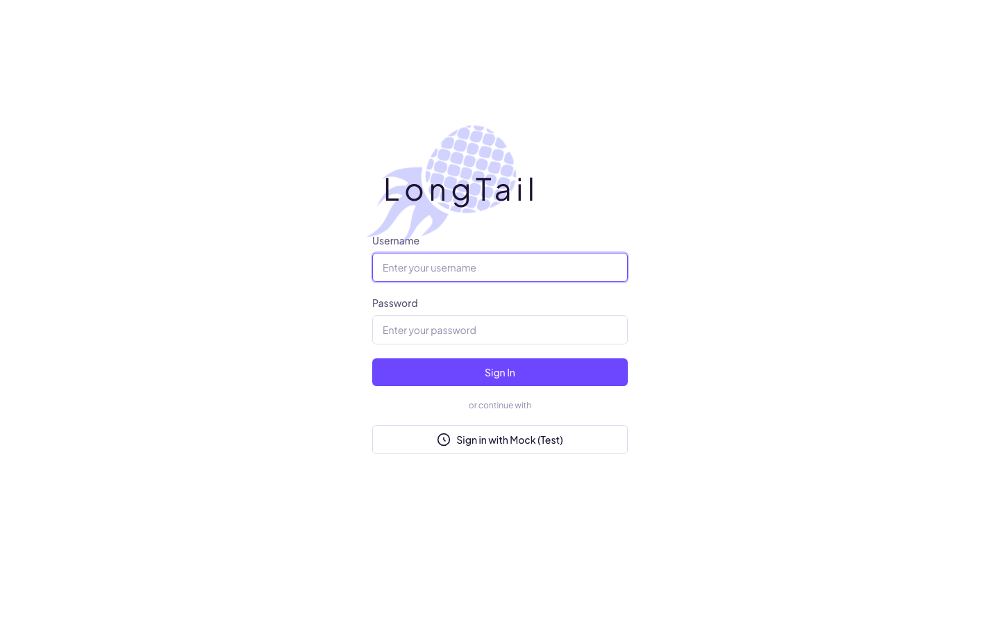
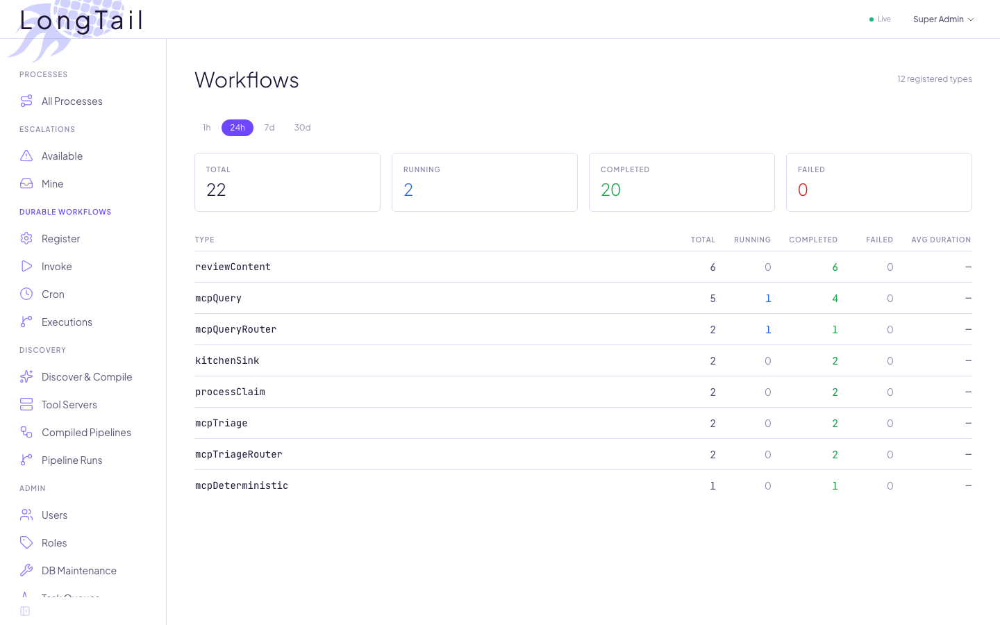
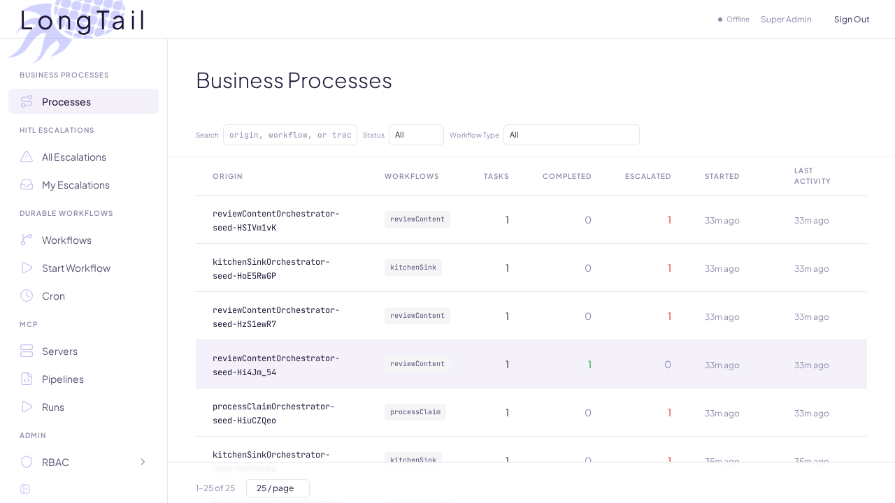
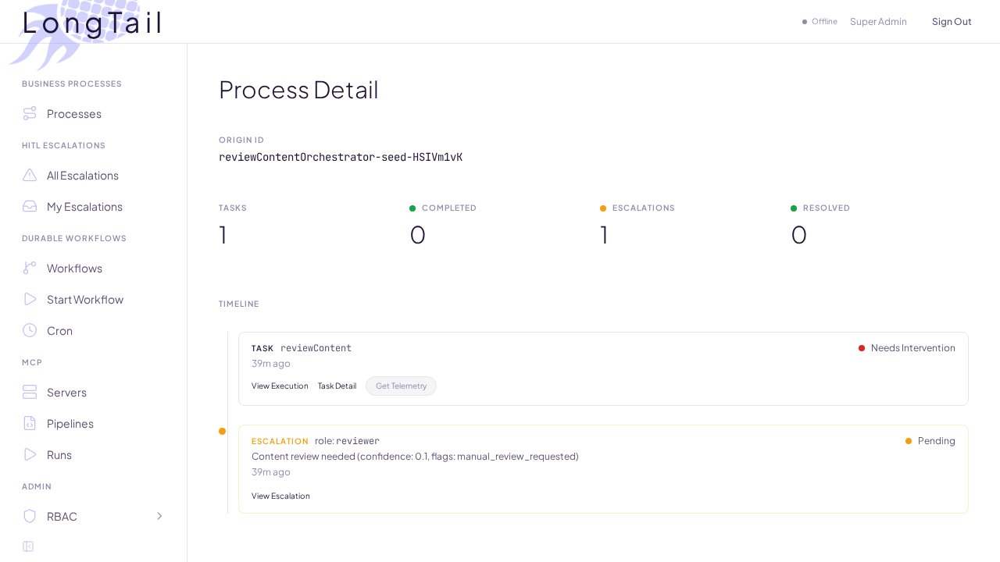
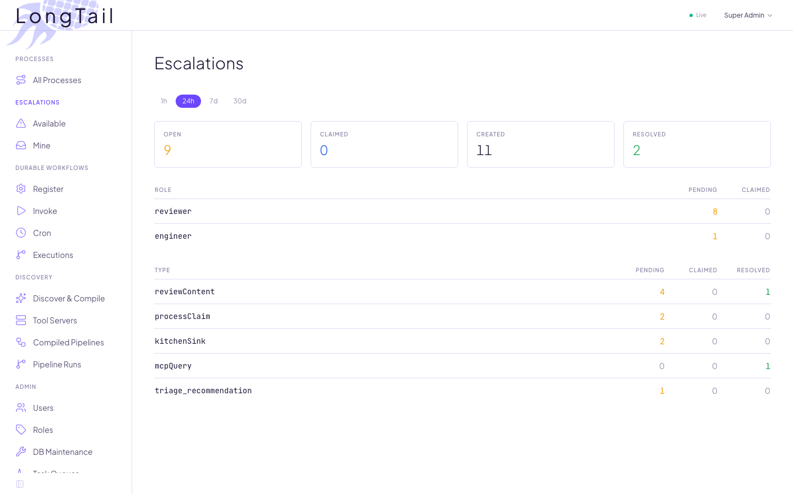
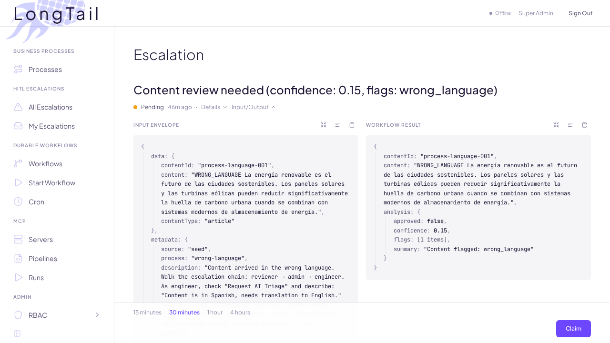
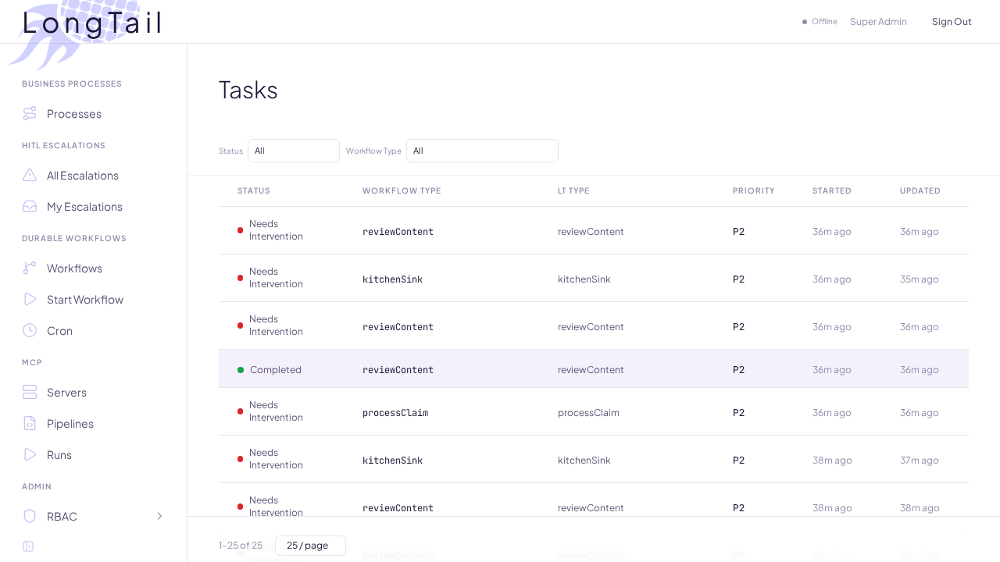
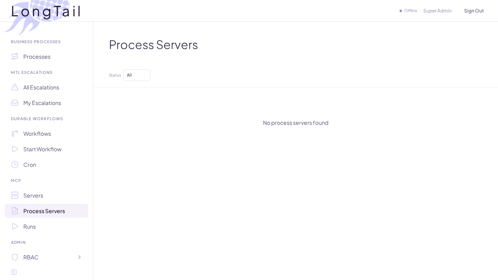

# QA Manual: The Self-Healing Pipeline

When an AI workflow fails — a scanned document is upside down, content arrives in the wrong language, data doesn't match — the system escalates to a human, triages with AI + MCP tools, fixes the root cause, re-runs the original workflow, and then *hardens the fix* into a new deterministic pipeline so the same problem never requires AI reasoning again.

This document walks through the entire golden path: from `git clone` through Docker setup, running tests, triggering the self-healing flow, compiling the fix into a YAML workflow, deploying it, and verifying it works.

---

## Table of Contents

1. [Clone and Start](#1-clone-and-start)
2. [The Dashboard](#2-the-dashboard)
3. [The Five Seed Processes](#3-the-five-seed-processes)
4. [Golden Path: Process 4 — The Upside-Down Document](#4-golden-path-process-4--the-upside-down-document)
5. [What Just Happened (Architecture)](#5-what-just-happened-architecture)
6. [Compiling the Fix: YAML Workflow Generation](#6-compiling-the-fix-yaml-workflow-generation)
7. [Deploying and Activating](#7-deploying-and-activating)
8. [Verifying the Compiled Workflow](#8-verifying-the-compiled-workflow)
9. [The Virtuous Cycle](#9-the-virtuous-cycle)
10. [Running Tests](#10-running-tests)
11. [Process 3: Wrong Language (Escalation Chain)](#11-process-3-wrong-language-escalation-chain)
12. [Process 5: Dynamic Triage (Generic Workflows)](#12-process-5-dynamic-triage-generic-workflows)
13. [Troubleshooting](#13-troubleshooting)

---

## 1. Clone and Start

```bash
git clone https://github.com/hotmeshio/long-tail.git
cd long-tail
```

Copy the environment template:

```bash
cp .env.example .env
```

Edit `.env` and add your OpenAI API key (required for AI triage and Vision workflows):

```
OPENAI_API_KEY=sk-your-key-here
```

Start everything with Docker:

```bash
docker compose up -d --build
```

This brings up three services:

| Service | Port | Purpose |
|---------|------|---------|
| **long-tail** | 3000 | API server + dashboard |
| **postgres** | 5432 | Durable state (workflows, tasks, escalations) |
| **nats** | 4222 / 9222 | Real-time events (client + WebSocket) |

Watch the logs until you see the seed processes launch:

```bash
docker compose logs -f long-tail
```

You'll see output like:

```
[long-tail] starting...
[long-tail] running migrations...
[long-tail] workers started on queues: long-tail, long-tail-verify, ...
[long-tail] MCP adapter connected
[long-tail] Dashboard: http://localhost:3000/
[long-tail] server running on port 3000
[examples] roles verified (reviewer, engineer, admin, superadmin)
[examples] seeded user (superadmin / superadmin123)
[examples] seeded user (reviewer / reviewer123)
[examples] MCP servers seeded (7 servers, 32 tools)
[examples] seeded: Process 1 — Clean Review
[examples] seeded: Process 2 — Flagged for Review
[examples] seeded: Process 3 — Wrong Language
[examples] seeded: Process 4 — Damaged Claim
[examples] seeded: Process 5 — Dynamic Triage
```

The Docker image uses `node:20-slim` (Debian) rather than Alpine because Playwright's Chromium requires glibc and system libraries (`libnss3`, `libgbm1`, `libxfixes3`, etc.) that Alpine doesn't provide. The Dockerfile installs these dependencies and runs `npx playwright install chromium` during the image build so the Playwright MCP server works out of the box.

---

## 2. The Dashboard

Open [http://localhost:3000](http://localhost:3000) in your browser.

Log in with one of the seeded accounts:

| Username | Password | Role | What you can do |
|----------|----------|------|-----------------|
| `superadmin` | `superadmin123` | superadmin | See everything |
| `reviewer` | `reviewer123` | reviewer | Review escalations, resolve with triage |
| `engineer` | `engineer123` | engineer | Handle technical escalations |
| `admin` | `admin123` | admin | Administrative escalations |

Log in as **superadmin** first to see the full picture.



After logging in as superadmin:



The dashboard shows:
- **Processes** — The primary entry point. Each process represents a business workflow and its current state. Click into any process to see its full timeline of tasks and escalations.
- **Escalations** — Pending human review items across all processes
- **MCP Servers** — Connected tool servers (7 built-in)
- **Process Servers** — Dynamic MCP servers generated from successful triage runs. Each namespace is a server; each compiled workflow is a tool. The system's evolving intelligence lives here.

> Tasks and escalations appear in context on each process detail page, so there is no need to navigate to them independently. For advanced users, a standalone Tasks list view is also available from the navigation.

---

## 3. The Five Seed Processes

Navigate to the **Processes** view. You'll see five workflows in various states:

| # | Process | Expected State | What It Demonstrates |
|---|---------|---------------|---------------------|
| 1 | Clean Review | **Completed** | Happy path. AI auto-approved. |
| 2 | Flagged for Review | **Needs Intervention** | Content flagged. Waiting for reviewer. |
| 3 | Wrong Language | **Needs Intervention** | Spanish content. Walk the escalation chain. |
| 4 | Damaged Claim | **Needs Intervention** | Upside-down document. Trigger AI triage. |
| 5 | Dynamic Triage | **Needs Intervention** | Generic workflow. Test pre-flight detection. |



### The Process Detail View

Click into any process to see its detail page. This is the primary navigation hub — everything about a business process is visible here.



The process detail page shows:
- **Timeline** — A chronological view of tasks and escalations that belong to this process
- **Task entries** — Each workflow execution (leaf workflow) appears as a row with its status, timestamps, and result summary
- **Escalation entries** — Any escalations raised during the process appear inline, showing their status (pending, claimed, resolved)

From the timeline, you can:
- **View Execution** — See the full workflow execution history (milestones, events, return data)
- **Task Detail** — Drill into a specific task's input/output and metadata
- **View Escalation** — Jump to the escalation detail for any pending or resolved escalation

This is the primary way to navigate the system. Processes are the top-level concept, and tasks and escalations are always viewed in the context of the process they belong to.

Click into **Process 1** to see a completed workflow — its task record, milestones, and return data. This is what success looks like. Every other process aims to reach this state.

---

## 4. Golden Path: Process 4 — The Upside-Down Document

This is the full self-healing story. An insurance claim arrives with a scanned document that's upside down. The AI can't read it, escalates to a human, the human triggers AI triage, the triage agent rotates the image, re-runs the claim, and everything completes.

### Step 1: See the Escalation

Navigate to the **Process 4** detail page. In the timeline, you'll see an escalation entry with status `pending`, assigned to the `reviewer` role.

You can also find it from the top-level **Escalations** view (type: `processClaim`).



Click into the escalation. You'll see the escalation detail page:



The escalation detail shows:
- **Input Envelope** (left panel) — The full input that was sent to the workflow, including document references (`page1_upside_down.png`, `page2.png`) and analysis parameters
- **Workflow Result** (right panel) — The output from the failed workflow execution, including the low confidence score (< 0.85) and flags about unreadable documents
- **Status**: `pending`
- **Claim button** (bottom-right) — Assigns this escalation to you so other reviewers know it's being handled

### Step 2: Log in as Reviewer and Claim

Log out and log back in as `reviewer` / `reviewer123`.

Navigate to **Escalations** or find the escalation through the Process 4 detail page. Click into the escalation to see the full detail view.

Click the **Claim** button at the bottom-right of the escalation detail. This assigns the escalation to your user, preventing other reviewers from working on it simultaneously. After claiming, the resolution form appears.

### Step 3: Resolve with AI Triage

The resolution form gives you two options:

1. **Standard resolution** — Provide corrected data directly using the context from the Input Envelope and Workflow Result panels (the human fixes it)
2. **Request AI Triage** — Check the triage checkbox and describe the problem

Check **"Request AI Triage"** and enter a description:

```
Page 1 appears to be scanned upside down. Cannot read member ID or address.
```

Click **Resolve**.

### Step 4: Watch the Triage

The system responds immediately with `{ triage: true, triageWorkflowId: "triage-..." }`.

Behind the scenes, a cascade of workflows just started:

1. **mcpTriageOrchestrator** — Container workflow (Phase 1 + Phase 2)
2. **mcpTriage** — Leaf workflow (LLM agentic loop with MCP tools)

Navigate back to the **Process 4** detail page to see the triage task appear in the timeline. You'll see new entries for the triage orchestrator and its child workflows as they execute.

The triage leaf is executing an LLM agentic loop:

1. **Gets tool inventory** — Discovers 5 MCP servers with 20 tools
2. **Reads the escalation context** — Upstream tasks, escalation history
3. **Calls `list_document_pages`** — Sees `page1_upside_down.png`
4. **Calls `extract_member_info`** — Vision API confirms the page is unreadable
5. **Calls `rotate_page`** with `degrees: 180` — Creates `page1_upside_down_rotated.png`
6. **Calls `extract_member_info`** again — Now it can read the member data
7. **Calls `validate_member`** — Confirms against the member database
8. **Returns corrected data** — Documents now reference the rotated image

This takes 30-60 seconds depending on OpenAI response times.

> For advanced users, a standalone Tasks list view is also available that shows all workflow executions across processes. You can filter by workflow type to find specific triage runs.
>
> 

### Step 5: Observe the Re-invocation

After triage completes (Phase 1), the orchestrator enters Phase 2:

- Re-invokes `processClaim` with the corrected documents
- The `envelope.resolver` field contains the triage output
- The claim workflow detects re-entry, skips escalation, processes normally
- The claim auto-approves with corrected data

### Step 6: Verify Completion

Navigate back to the **Process 4** detail page. The timeline should now show:

- **Task status**: `completed`
- **Milestones**: Includes `triage: completed`, `triage_method: llm_with_tools`
- **Data**: Corrected claim with `triaged: true`

Click **View Execution** on the completed task to see the full details.

Check the escalation entry in the timeline — it's now `resolved` with:

```json
{
  "_lt": {
    "triaged": true,
    "triageWorkflowId": "triage-..."
  }
}
```

The parent orchestrator's `waitFor` signal resolved. The deterministic pipeline completed as if nothing went wrong.

---

## 5. What Just Happened (Architecture)

Here's the full signal flow, from escalation to completion:

```
                    ORIGINAL PIPELINE
                    ════════════════
processClaimOrchestrator
  │
  ├─ executeLT(processClaim)
  │    ├─ createTask
  │    ├─ startChild → processClaim runs
  │    │    ├─ analyzeDocuments → low confidence (upside-down)
  │    │    └─ return { type: 'escalation' }
  │    │
  │    └─ waitFor(signalId) ──────────────── BLOCKED
  │                                           │
                    ESCALATION                │
                    ══════════                │
Interceptor:                                  │
  ├─ Creates lt_escalations record            │
  ├─ Marks task needs_intervention            │
  └─ Publishes escalation.created event       │
                                              │
Human claims escalation                       │
Human resolves with needsTriage: true         │
                                              │
                    TRIAGE                    │
                    ══════                    │
mcpTriageOrchestrator (container)             │
  │                                           │
  ├─ Phase 1: executeLT(mcpTriage)            │
  │    ├─ LLM + MCP tools                     │
  │    ├─ rotate_page, extract_member_info    │
  │    └─ return { correctedData }            │
  │                                           │
  ├─ Phase 2: executeLT(processClaim)         │
  │    ├─ envelope.resolver = correctedData   │
  │    ├─ processClaim detects re-entry       │
  │    ├─ Processes with corrected docs       │
  │    └─ return { type: 'return', data }     │
  │                                           │
  └─ Interceptor signals parent ──────────────┘
                                              │
                    COMPLETION                │
                    ══════════                │
  waitFor resolves with triage result         │
  ltCompleteTask marks task completed         │
  Pipeline continues deterministically        ▼
```

Key insight: The parent orchestrator never died. It stayed alive on `waitFor`. Signals — not child workflows — maintain continuity. This is the "vortex" pattern: a completely separate remediation orchestration runs independently while the parent waits.

---

## 6. Compiling the Fix: YAML Workflow Generation

The triage worked, but it used LLM reasoning (multiple OpenAI calls, tool selection, interpretation). The next time an upside-down document appears, we don't want to pay that cost. We want a deterministic pipeline.

### Find the Triage Execution

Navigate to the **Process 4** detail page and find the completed `mcpTriage` task in the timeline. Click **View Execution** to see its details and note the `workflow_id`.

### Generate the YAML Workflow

Call the API to compile the triage execution into a YAML workflow:

```bash
# Get a JWT token first
TOKEN=$(curl -s http://localhost:3000/api/auth/login \
  -H 'Content-Type: application/json' \
  -d '{"username":"superadmin","password":"superadmin123"}' | jq -r '.token')

# Generate YAML from the triage execution
curl -s http://localhost:3000/api/yaml-workflows \
  -H "Authorization: Bearer $TOKEN" \
  -H 'Content-Type: application/json' \
  -d '{
    "workflow_id": "<TRIAGE_WORKFLOW_ID>",
    "task_queue": "lt-mcp-triage",
    "workflow_name": "mcpTriage",
    "name": "rotate-and-verify-document",
    "description": "Rotate upside-down document pages, extract member info, and validate against member database"
  }' | jq .
```

The response contains the generated workflow:

```json
{
  "id": "uuid-of-yaml-workflow",
  "name": "rotate-and-verify-document",
  "status": "draft",
  "app_id": "lt-yaml",
  "graph_topic": "rotate_and_verify_document",
  "activity_manifest": [
    {
      "activity_id": "rotate_and_verify_document_a0",
      "title": "Rotate Page",
      "tool_source": "mcp",
      "mcp_server_id": "long-tail-document-vision",
      "mcp_tool_name": "rotate_page"
    },
    {
      "activity_id": "rotate_and_verify_document_a1",
      "title": "Extract Member Info",
      "tool_source": "mcp",
      "mcp_server_id": "long-tail-document-vision",
      "mcp_tool_name": "extract_member_info"
    },
    {
      "activity_id": "rotate_and_verify_document_a2",
      "title": "Validate Member",
      "tool_source": "mcp",
      "mcp_server_id": "long-tail-document-vision",
      "mcp_tool_name": "validate_member"
    }
  ],
  "input_schema": { ... },
  "output_schema": { ... }
}
```

<!-- API response -- run the curl command above to see the generated manifest -->

### What the Generator Does

The generator analyzes the completed execution's event timeline and extracts the *tool call sequence* — just the tools, arguments, and data flow. All LLM reasoning is stripped out:

```
Original triage execution:
  LLM decides → list_document_pages
  LLM decides → extract_member_info (fails: upside down)
  LLM decides → rotate_page (180°)
  LLM decides → extract_member_info (succeeds)
  LLM decides → validate_member
  LLM synthesizes result

Compiled YAML workflow:
  rotate_page → extract_member_info → validate_member
  (no LLM calls, direct tool-to-tool data piping)
```

### View the Raw YAML

```bash
curl -s http://localhost:3000/api/yaml-workflows/<YAML_ID>/yaml \
  -H "Authorization: Bearer $TOKEN"
```

This returns the HotMesh YAML definition — a graph of activities connected by transitions with data flowing from one step to the next.

---

## 7. Deploying and Activating

The workflow starts as a `draft`. It needs two more steps to go live.

### Deploy

Deploying validates the YAML and registers it with the HotMesh engine:

```bash
curl -s -X POST http://localhost:3000/api/yaml-workflows/<YAML_ID>/deploy \
  -H "Authorization: Bearer $TOKEN" \
  -H 'Content-Type: application/json' | jq .
```

Status transitions: `draft` -> `deployed`

### Activate

Activating starts HotMesh workers on the activity topics and makes the workflow invocable:

```bash
curl -s -X POST http://localhost:3000/api/yaml-workflows/<YAML_ID>/activate \
  -H "Authorization: Bearer $TOKEN" \
  -H 'Content-Type: application/json' | jq .
```

Status transitions: `deployed` -> `active`

### One-Step Deploy + Activate

You can also combine both steps:

```bash
curl -s -X POST http://localhost:3000/api/yaml-workflows/<YAML_ID>/deploy \
  -H "Authorization: Bearer $TOKEN" \
  -H 'Content-Type: application/json' \
  -d '{"activate": true}' | jq .
```



---

## 8. Verifying the Compiled Workflow

### Direct Invocation

Test the compiled workflow by calling it directly:

```bash
curl -s -X POST http://localhost:3000/api/yaml-workflows/<YAML_ID>/invoke \
  -H "Authorization: Bearer $TOKEN" \
  -H 'Content-Type: application/json' \
  -d '{
    "input": {
      "image_ref": "page1_upside_down.png",
      "degrees": 180,
      "page_number": 1
    }
  }' | jq .
```

This runs the same tool sequence — rotate, extract, validate — but without any LLM calls. It's deterministic, fast, and tracked.

### MCP Tool Visibility

The active workflow is now visible as an MCP tool. Future triage runs will discover it:

```bash
# List available compiled workflows via MCP
curl -s http://localhost:3000/api/yaml-workflows?status=active \
  -H "Authorization: Bearer $TOKEN" | jq '.workflows[].name'
```

The triage system prompt instructs the LLM:

> *"ALWAYS check compiled workflows first. If a compiled workflow matches the problem, invoke it directly. This is the most efficient path — deterministic, no LLM reasoning, proven results."*

### The Three-Tier Resolution

When the next upside-down document appears, the triage controller has three resolution tiers:

| Tier | Method | LLM Calls | Speed |
|------|--------|-----------|-------|
| 1 | **Pre-flight regex** | 0 | Instant |
| 2 | **Compiled workflow** | 0 | Seconds |
| 3 | **Full agentic loop** | N | 30-60s |

The compiled workflow you just created lives at Tier 2. The system checks it *before* firing up the full LLM agentic loop. If the problem matches, the fix is deterministic and near-instant.

---

## 9. The Virtuous Cycle

This is how the system avoids entropy:

```
 ┌──────────────────────────────────────────────────────┐
 │                                                      │
 │  1. Deterministic workflow fails on edge case        │
 │     (upside-down scan, wrong language, bad data)     │
 │                          │                           │
 │                          ▼                           │
 │  2. System escalates to human                        │
 │     (reviewer sees the problem in the dashboard)     │
 │                          │                           │
 │                          ▼                           │
 │  3. Human triggers AI triage                         │
 │     (checks "Request AI Triage", describes problem)  │
 │                          │                           │
 │                          ▼                           │
 │  4. Triage agent diagnoses + fixes with MCP tools    │
 │     (LLM reasoning, multiple tool calls, adapts)     │
 │                          │                           │
 │                          ▼                           │
 │  5. Original workflow re-runs with corrected data    │
 │     (deterministic pipeline completes normally)      │
 │                          │                           │
 │                          ▼                           │
 │  6. Engineer compiles fix into YAML workflow         │
 │     (strips LLM reasoning, keeps tool sequence)      │
 │                          │                           │
 │                          ▼                           │
 │  7. Next occurrence: compiled workflow handles it    │
 │     (0 LLM calls, deterministic, instant)            │
 │                          │                           │
 │                          ▼                           │
 │  8. System is stronger than before                   │
 │     (new edge case? → back to step 1)                │
 │                                                      │
 └──────────────────────────────────────────────────────┘
```

Every failure makes the system better. Every triage teaches it a new pattern. Every compiled workflow reduces future cost and latency. The system doesn't just recover — it hardens.

And if the triage agent encounters a problem it *can't* solve? It escalates to engineering with specific recommendations:

> *"I tried rotate_page and extract_member_info but the document appears to be a multi-column PDF, not a simple scan. Recommend installing an MCP server with PDF layout analysis tools (e.g., pdfplumber). After installing, resolve this escalation with 'ready' and I'll retry."*

The engineer installs the tool, resolves with "ready", and the triage re-runs with the new capability. Then that pattern gets compiled too.

---

## 10. Running Tests

### Prerequisites

The test database (`longtail_test`) is automatically created by the Docker init script. If running locally, ensure Postgres is accessible and the database exists:

```bash
createdb -U postgres longtail_test
```

### Backend Tests

From the project root:

```bash
# All backend tests (sequential, ~6 minutes)
npm test

# Specific test suites
npm run test:workflows           # Workflow integration tests
npm run test:mcp                 # MCP server tests
npm run test:mcp:triage          # MCP triage flow (requires OPENAI_API_KEY)
npm run test:vision              # Vision document tests (requires OPENAI_API_KEY)
```

Tests that call OpenAI (Vision, triage) require `OPENAI_API_KEY` in your environment. Tests without it run the deterministic paths only.

The test configuration (`vitest.config.ts`) forces `POSTGRES_DB=longtail_test` with a runtime safety guard that throws if any other database name is detected.

```
 Test Files  27 passed (27)
      Tests  368 passed (368)
```

<!-- Terminal output -- run `npm test` from project root -->

### Frontend Tests

From the `dashboard/` directory:

```bash
cd dashboard
npm test
```

```
 Test Files  34 passed (34)
      Tests  292 passed (292)
```

<!-- Terminal output -- run `npm test` from dashboard/ -->

### What the Tests Cover

| Test File | What It Validates |
|-----------|-------------------|
| `events.test.ts` | Milestone events publish from interceptor, orchestrator, and activities |
| `orchestrated.test.ts` | `executeLT` flow: task creation, escalation, signal-back, completion |
| `kitchen-sink.test.ts` | Full workflow lifecycle with durable sleep and escalation |
| `process-claim.test.ts` | End-to-end triage: escalate, rotate image, re-run, complete |
| `mcp-client.test.ts` | Built-in server auto-connection and tool routing |
| `escalations.test.ts` | Escalation CRUD, claiming, role-based access |

---

## 11. Process 3: Wrong Language (Escalation Chain)

Process 3 demonstrates the escalation chain — a multi-hop human workflow before triage.

### The Story

Content arrives in Spanish with a `WRONG_LANGUAGE` marker. The AI flags it with 0.15 confidence and escalates to a reviewer.

### Walk the Chain

1. **Log in as `reviewer`** (`reviewer123`)
   - Navigate to the **Process 3** detail page and find the escalation in the timeline
   - Click into the escalation detail — review the Input Envelope and Workflow Result panels for context
   - Click **Claim** to assign it to yourself
   - You're a content reviewer, not a translator
   - **Escalate to admin**: "This is a language issue, outside my review scope"

2. **Log in as `admin`** (`admin123`)
   - Navigate to the **Process 3** detail page and find the re-escalated item in the timeline
   - Click into the escalation detail, then **Claim** it
   - This needs engineering, not administrative action
   - **Escalate to engineer**: "Content is in the wrong language, needs technical fix"

3. **Log in as `engineer`** (`engineer123`)
   - Navigate to the **Process 3** detail page and find the escalation
   - Click into the escalation detail, then **Claim** it
   - You have the tools and authority to trigger triage
   - Check **"Request AI Triage"**
   - Describe: "Content is in Spanish, needs translation to English"
   - **Resolve**

### What Triage Does

The triage agent:

1. Reads the escalation context — sees the content and language flags
2. Calls `translate_content` tool (Vision MCP server) — translates Spanish to English
3. Returns corrected data with translated content
4. Phase 2 re-runs `reviewContent` with the English version
5. AI analysis now returns high confidence — auto-approved

The triage also calls `notifyEngineering` to recommend adding a language detection step to the content review pipeline:

> *"Escalation was caused by content in Spanish. Consider adding an upstream language detection activity that auto-translates before AI analysis."*

That recommendation becomes a `triage_recommendation` escalation — an engineering backlog item.

---

## 12. Process 5: Dynamic Triage (Generic Workflows)

Process 5 proves the triage controller works with *any* workflow, not just document processing.

### The Kitchen Sink

The `kitchenSink` workflow is intentionally generic — it runs a durable sleep, does some basic processing, and always escalates for reviewer approval. There are no documents, no claims, no domain logic.

### Pre-Flight Detection

Log in as `reviewer` and navigate to the **Process 5** detail page. Find the escalation in the timeline, click into the escalation detail, **Claim** it, and resolve with triage checked and a simple message:

```
This looks fine, just approve it.
```

The triage controller detects this as a simple approval via regex pre-flight matching. No LLM call needed. The response comes back instantly with `triage_method: pre_flight`.

Navigate back to the **Process 5** detail page to see the updated timeline with the completed task.

### Full Agentic Path

Try a more complex message instead:

```
Something seems wrong. Check the system health and recent escalation stats before approving.
```

Now the triage controller can't pattern-match this. It fires up the full LLM loop. The agent:

1. Calls `long_tail_db__find_tasks` — queries recent task history
2. Calls `long_tail_db__get_system_health` — checks system metrics
3. Reads the escalation stats
4. Synthesizes a response: "System appears healthy. 12 tasks completed in the last hour, 0 failures. Approving."

This demonstrates that the triage controller adapts to *any* workflow type and uses whatever MCP tools are available to investigate and resolve.

---

## 13. Troubleshooting

### Docker won't start

```bash
# Clean everything and rebuild
docker compose down -v
docker compose up -d --build
```

The `-v` flag removes the Postgres volume, giving you a fresh database. All migrations and seeds run on startup.

### Port conflicts

Edit the left side of port mappings in `docker-compose.yml`:

```yaml
ports:
  - "3001:3000"    # API on port 3001 instead
  - "5433:5432"    # Postgres on 5433
```

Or use environment variables:

```bash
LT_PORT=3001 LT_PG_PORT=5433 docker compose up -d
```

### Triage hangs

If triage takes more than 2 minutes, check:

1. `OPENAI_API_KEY` is set and valid
2. Docker logs: `docker compose logs -f long-tail`
3. The triage task on the process detail page — it shows milestones as it progresses

If the LLM enters an infinite tool-calling loop (> 10 rounds), the triage exhaustion handler forces a final synthesis or escalates to engineering.

### Tests fail with "database does not exist"

```bash
# Create the test database manually
docker compose exec postgres createdb -U postgres longtail_test
```

Or restart with clean volumes (`docker compose down -v && docker compose up -d --build`) — the init script creates it automatically.

### "No escalation found" timeout in tests

Tests that depend on OpenAI have longer timeouts (45-90s). If Vision API is slow, some tests may time out. Re-run the specific test:

```bash
npx vitest run tests/workflows/process-claim.test.ts
```

### Dashboard doesn't load

The dashboard is built during the Docker image build. If running locally:

```bash
cd dashboard
npm install
npm run build
cd ..
npm run start:dev
```

---

## Appendix: API Quick Reference

### Authentication

```bash
# Login → get JWT token
curl -s http://localhost:3000/api/auth/login \
  -H 'Content-Type: application/json' \
  -d '{"username":"superadmin","password":"superadmin123"}'

# Use token in subsequent requests
-H "Authorization: Bearer $TOKEN"
```

### Escalations

```bash
# List pending escalations
GET /api/escalations?status=pending

# Get escalation detail
GET /api/escalations/:id

# Resolve (standard)
POST /api/escalations/:id/resolve
{ "resolverPayload": { "approved": true, "notes": "Looks good" } }

# Resolve (with triage)
POST /api/escalations/:id/resolve
{ "resolverPayload": { "_lt": { "needsTriage": true }, "notes": "Document is upside down" } }
```

### YAML Workflows

```bash
# Generate from execution
POST /api/yaml-workflows
{ "workflow_id": "...", "task_queue": "...", "workflow_name": "...", "name": "..." }

# Deploy
POST /api/yaml-workflows/:id/deploy

# Activate
POST /api/yaml-workflows/:id/activate

# Deploy + activate in one step
POST /api/yaml-workflows/:id/deploy
{ "activate": true }

# Invoke
POST /api/yaml-workflows/:id/invoke
{ "input": { ... } }

# List active
GET /api/yaml-workflows?status=active

# Get raw YAML
GET /api/yaml-workflows/:id/yaml
```

### Tasks

```bash
# List tasks
GET /api/tasks?workflow_type=processClaim&status=completed

# Get task detail
GET /api/tasks/:id
```
